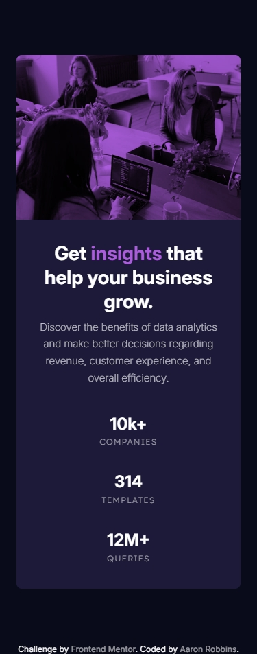
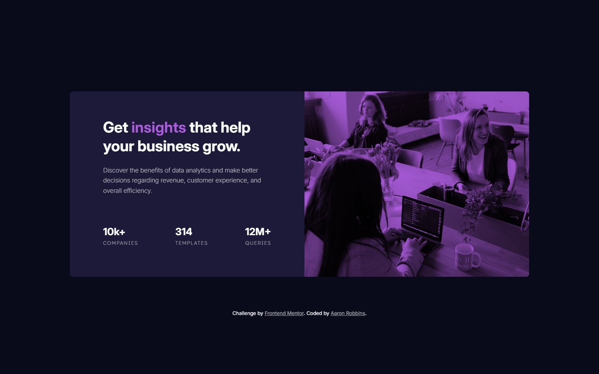
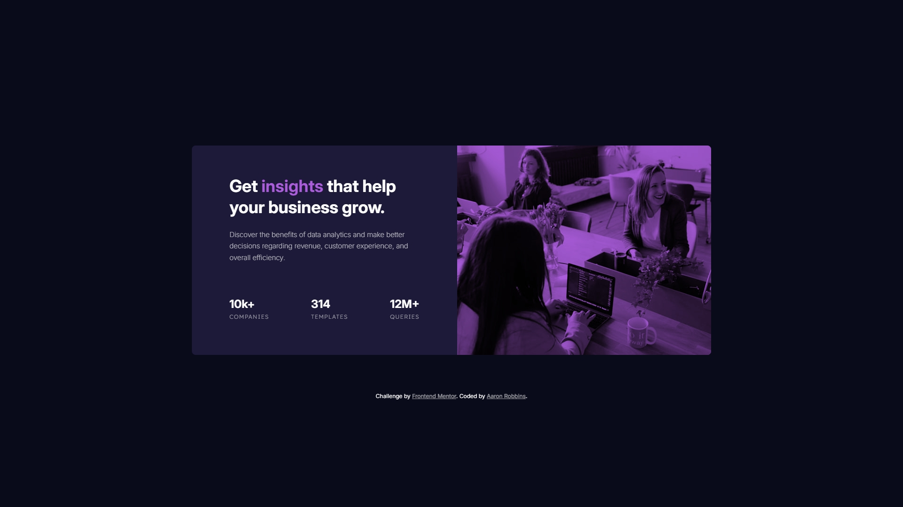

# Frontend Mentor - Stats preview card component solution

This is a solution to the [Stats preview card component challenge on Frontend Mentor](https://www.frontendmentor.io/challenges/stats-preview-card-component-8JqbgoU62). Frontend Mentor challenges help you improve your coding skills by building realistic projects.

## Table of contents

- [Overview](#overview)
  - [The challenge](#the-challenge)
  - [Screenshot](#screenshot)
  - [Links](#links)
- [My process](#my-process)
  - [Built with](#built-with)
  - [What I learned](#what-i-learned)
  - [AI Collaboration](#ai-collaboration)
- [Author](#author)
- [Acknowledgments](#acknowledgments)

## Overview

### The challenge

Users should be able to:

- View the optimal layout depending on their device's screen size

### Screenshot






### Links

- [Solution URL](https://www.frontendmentor.io/solutions/responsive-order-summary-card-Xgwkta2Az9)
- [Live Site URL](https://freexm1nd.github.io/order-summary-component/)

## My process

### Built with

- Semantic HTML5 markup
- CSS custom properties
- Flexbox
- Mobile-first workflow
- CSS Nesting

### What I learned

I used this project as an opportunity to polish the nesting skills I have learned. I want to, at some point, use a preprocessor, and I know nesting is just one of the many cool features of preprocessors. I think now knowing that native CSS has nesting, it's a great opportunity to get my feet wet without taking the dive. With these newfound skills, I've learned that nesting definitely changes what I knew about the cascade and precedence, especially in media queries. Definitely something to keep in mind going forward.

During the creation of this project, I also learned about the picture element and how handy it can be when creating responsive layouts.

```html
<div class="stats-preview-card-image">
  <picture class="hero-image">
    <source
      class="desktop-image"
      srcset="./images/image-header-desktop.jpg"
      media="(width >= 43.75rem)"
    />
    
  </picture>
</div>
```

```css
@media screen and (width >= 43.75rem) {
  .stats-preview-card {
    max-width: 73%;
  }

  .stats-preview-content {
    padding: var(--spacing-64) var(--spacing-80);
    text-align: left;

    & .stats-preview-heading {
      margin-bottom: var(--spacing-24);
      font-size: var(--font-size-36);
    }

    & .stats-preview-discover {
      margin-bottom: var(--spacing-72);
    }
    & .stats {
      flex-direction: row;
      justify-content: space-between;
    }
  }
}
```

### Continued development

Nesting is just one of the new features of native CSS I've explored so far in preparation for learning a preprocessor. I want to explore native a bit more and see what other preprocessor-like features it has right now.

In a video I had watched about preprocessors, it included some info about BEM, and that could be another skill I start learning.

### Useful resources

- [<picture>](https://developer.mozilla.org/en-US/docs/Web/HTML/Reference/Elements/picture) - This is the documentation I read to learn about the picture element.

- [& Nesting Selector](https://developer.mozilla.org/en-US/docs/Web/CSS/Reference/Selectors/Nesting_selector) - This is the documentation I sourced to learn more about nesting.

### AI Collaboration

I used Claude in this challenge to assist in brainstorming solutions and to assist in debugging.

## Author

- GitHub - [Aaron Robbins](https://github.com/FREExM1ND)
- Frontend Mentor - [@FREExM1ND](https://www.frontendmentor.io/profile/FREExM1ND)

## Acknowledgments

Really thankful to have Mozilla's MDN Web Docs around so I can source some good documentation during these projects.

I'm thankful for the team at Responsively for creating a useful development tool. Thank you to Frontend Mentor for the challenge. I'm eager to do more.
